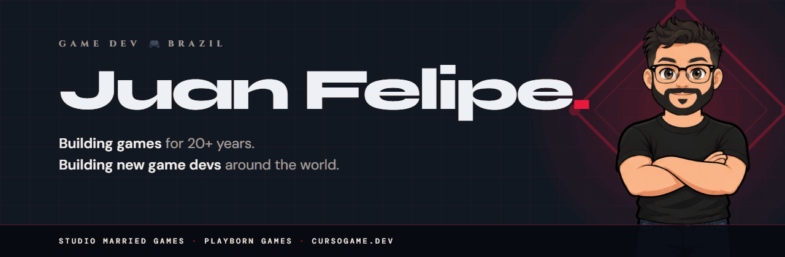
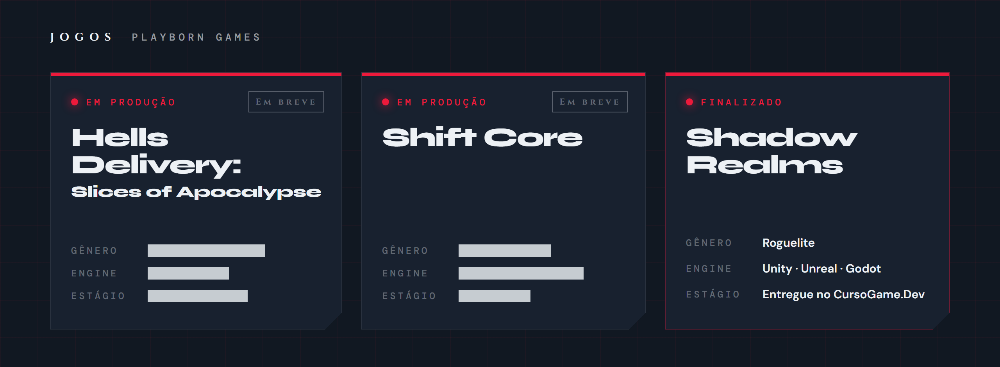
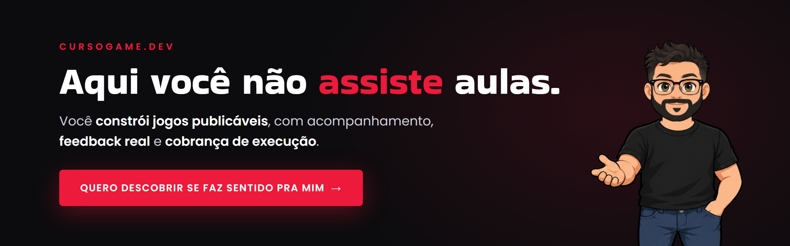

  

  
  
  
  
  
  

### 🧰 O que eu uso

  

  

  

### 🇧🇷 Sobre

Programo há mais de 20 anos. Fundei o Studio Married Games em 2013 e fiz jogos pra Petrobras, Bauducco, Submarino, Fini e C&A. Hoje faço jogos na **[Playborn Games](https://playborn.games)** e formo novos game devs no **[CursoGame.Dev](https://lp.cursogame.dev?utm_source=gh&utm_medium=profile&utm_campaign=github-readme)**, onde você constrói jogos publicáveis, com acompanhamento, feedback real e cobrança de execução.

Contato: [juan@juanfelipe.dev](mailto:juan@juanfelipe.dev)

### 🇺🇸 About

I've been programming for 20+ years. I founded Studio Married Games in 2013 and made games for Petrobras, Bauducco, Submarino, Fini and C&A. Today I make games at **[Playborn Games](https://playborn.games)** and train new game devs at **[CursoGame.Dev](https://lp.cursogame.dev?utm_source=gh&utm_medium=profile&utm_campaign=github-readme)**, where you build publishable games with guidance, real feedback and accountability.

Contact: [juan@juanfelipe.dev](mailto:juan@juanfelipe.dev)

### ▶️ Últimos vídeos

<!-- YOUTUBE:START -->
<table align="center">
<tr><td valign="top"></td><td valign="top"></td><td valign="top"></td></tr>
<tr><td valign="top"></td><td valign="top"></td><td valign="top"></td></tr>
</table>
<!-- YOUTUBE:END -->

<a href="https://www.youtube.com/@gamedevjuan">todos os vídeos →</a>

### 📝 Do blog

<!-- BLOG:START -->
- [Preciso de Empresa para Vender Jogo? MEI e Impostos](https://cursogame.dev/blog/abrir-empresa-jogos-mei-brasil)
- [Algoritmo da Steam: Como a Loja Decide Quais Jogos Mostrar (e Como Trabalhar a Seu Favor)](https://cursogame.dev/blog/algoritmo-da-steam-como-funciona)
- [Como Analisar Concorrentes na Steam Antes de Lançar](https://cursogame.dev/blog/analise-concorrentes-steam-jogo)
- [Análise SWOT para um projeto de jogo: guia prático](https://cursogame.dev/blog/analise-swot-projeto-de-jogo)
- [Animação de Sprite 2D: Como Animar seu Personagem](https://cursogame.dev/blog/animacao-sprite-2d-jogo)
- [AnimationPlayer no Godot 4: Anime Tudo na Cena](https://cursogame.dev/blog/animationplayer-godot)
- [Anti-Cheat em Jogo Online Indie: O Que Fazer na Prática](https://cursogame.dev/blog/anti-cheat-jogos-online-indie)
- [Como Colocar Anúncios em Jogo Mobile com AdMob: Banner, Interstitial e Rewarded](https://cursogame.dev/blog/anuncios-em-jogo-mobile)
- [Da pra Aprender a Criar Jogos Depois dos 30?](https://cursogame.dev/blog/aprender-a-criar-jogos-depois-dos-30)
- [Aprender a Criar Jogos Sozinho ou Fazer um Curso?](https://cursogame.dev/blog/aprender-a-criar-jogos-sozinho-ou-curso)
<!-- BLOG:END -->

<a href="https://cursogame.dev/blog">todos os artigos →</a>

