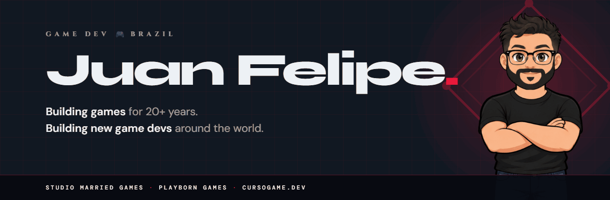
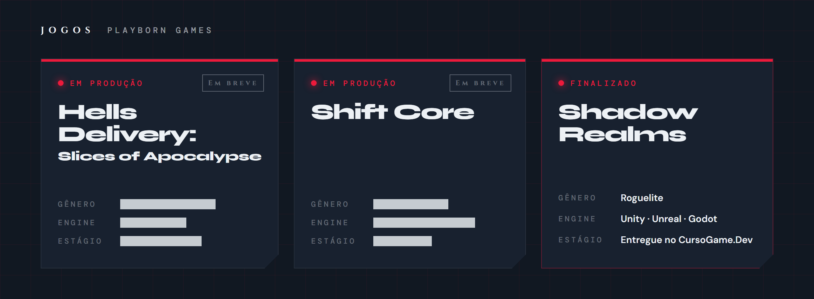
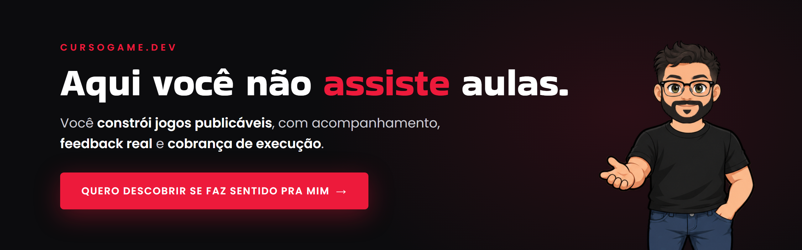

  

  
  
  
  
  
  

### 🧰 O que eu uso

  

  

  

### 🇧🇷 Sobre

Programo há mais de 20 anos. Fundei o Studio Married Games em 2013 e fiz jogos pra Petrobras, Bauducco, Submarino, Fini e C&A. Hoje faço jogos na **[Playborn Games](https://playborn.games)** e formo novos game devs no **[CursoGame.Dev](https://lp.cursogame.dev?utm_source=gh&utm_medium=profile&utm_campaign=github-readme)**, onde você constrói jogos publicáveis, com acompanhamento, feedback real e cobrança de execução.

Contato: [juan@juanfelipe.dev](mailto:juan@juanfelipe.dev)

### 🇺🇸 About

I've been programming for 20+ years. I founded Studio Married Games in 2013 and made games for Petrobras, Bauducco, Submarino, Fini and C&A. Today I make games at **[Playborn Games](https://playborn.games)** and train new game devs at **[CursoGame.Dev](https://lp.cursogame.dev?utm_source=gh&utm_medium=profile&utm_campaign=github-readme)**, where you build publishable games with guidance, real feedback and accountability.

Contact: [juan@juanfelipe.dev](mailto:juan@juanfelipe.dev)

### ▶️ Últimos vídeos

<!-- YOUTUBE:START -->
<table align="center">
<tr><td valign="top"></td><td valign="top"></td><td valign="top"></td></tr>
<tr><td valign="top"></td><td valign="top"></td><td valign="top"></td></tr>
</table>
<!-- YOUTUBE:END -->

<a href="https://www.youtube.com/@gamedevjuan">todos os vídeos →</a>

### 📝 Do blog

<!-- BLOG:START -->
- [007 First Light vende 3 milhões em duas semanas na Steam](https://cursogame.dev/blog/007-first-light-3-milhoes-duas-semanas)
- [Os 12 Princípios da Animação Aplicados a Jogos](https://cursogame.dev/blog/12-principios-da-animacao-jogos)
- [20 Second Game Jam 2026: Faça um Jogo de 20 Segundos](https://cursogame.dev/blog/20-second-game-jam-2026)
- [Preciso de MEI para Vender Jogos? CNAE e Imposto](https://cursogame.dev/blog/abrir-empresa-jogos-mei-brasil)
- [Como Aceitar Doações no Seu Jogo Indie com Ko-fi](https://cursogame.dev/blog/aceitar-doacoes-jogo-ko-fi)
- [Como Fazer Agua em Pixel Art para Jogos 2D](https://cursogame.dev/blog/agua-pixel-art-jogos-2d)
- [Algoritmo da Steam: Como a Loja Decide Quais Jogos Mostrar](https://cursogame.dev/blog/algoritmo-da-steam-como-funciona)
- [Alternativa ao Photoshop Gratuito para Arte de Jogo](https://cursogame.dev/blog/alternativa-ao-photoshop-gratis)
- [Como ampliar pixel art sem borrar (passo a passo)](https://cursogame.dev/blog/ampliar-pixel-art-sem-borrar)
- [Analisar Concorrentes na Steam: Workflow Antes de Lançar](https://cursogame.dev/blog/analise-concorrentes-steam-jogo)
<!-- BLOG:END -->

<a href="https://cursogame.dev/blog">todos os artigos →</a>

